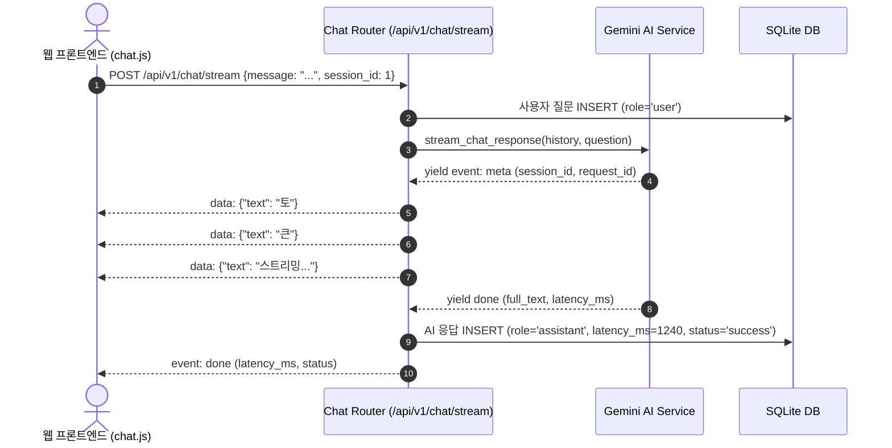

# 🔬 웹 기반 AI 챗봇 서비스 개발: 초정밀 현미경 학습 가이드 및 마스터 로드맵

> **문서 목적**: 본 가이드는 [mission.html](file:///c:/Users/alzznd/Desktop/chatbot/mission.html) 미션의 요구사항과 본 프로젝트에 구현된 실제 코드베이스([c:/Users/alzznd/Desktop/chatbot](file:///c:/Users/alzznd/Desktop/chatbot)) 간의 정합성을 1:1로 매핑하여, 시스템의 모든 레이어를 현미경 수준으로 분해하고 학습하기 위해 작성된 종합 엔지니어링 가이드입니다.

---

## 🧭 [Part 1] 미션의 본질적 함의와 아키텍처 정합성

### 1.1 왜 단순한 'AI API 호출'이 아닌 '웹 서비스'인가?
단순히 터미널에서 LLM API를 호출하는 것은 수십 줄의 코드로 가능합니다. 하지만 **실제 사용자가 접속하여 사용하는 엔터프라이즈급 AI 챗봇 서비스**는 다음의 복합적인 엔지니어링 과제를 해결해야 합니다:

```
[클라이언트 (브라우저)]
       │  ▲  (HTTP Request / SSE Event Stream)
       ▼  │
[FastAPI 웹 서버] ── (Request ID 추적 & 지연시간 측정 미들웨어)
       │
       ├── [보안/인증 계층]: Bcrypt 해시 검증 + HttpOnly Cookie JWT 토큰 발행
       ├── [세션/상태 관리]: 멀티 세션 CRUD + 최근 N개 롤링 윈도우 컨텍스트 조립
       ├── [AI 스트리밍 계층]: Google Gemma/Gemini 비동기 스트리밍 + 타임아웃 방어 + Mock 폴백
       ├── [관측/로깅 계층]: 4대 필수 이벤트(수신, AI호출, AI완료, DB저장) 구조화 로깅
       └── [데이터 영속화]: SQLite + SQLAlchemy 2.0 ORM (사용자, 세션, 메시지, 지연시간)
```

### 1.2 미션 요구사항 vs 구현 결과 정합성 매트릭스

| 미션 요구 영역 | 미션 명세 세부 요건 | 실제 구현 파일 및 함수 | 정합성 검증 결과 |
| :--- | :--- | :--- | :---: |
| **단일 서버 패키징** | 별도 프론트 빌드 없이 단일 명령어로 실행 | [app/main.py](file:///c:/Users/alzznd/Desktop/chatbot/app/main.py), [app/api/web.py](file:///c:/Users/alzznd/Desktop/chatbot/app/api/web.py) | **100% 충족** (`uv run python app/main.py`) |
| **사용자 인증 & 보안** | 계정 생성, 로그인, 인증 기반 접근 제어 | [app/core/security.py](file:///c:/Users/alzznd/Desktop/chatbot/app/core/security.py), [app/api/deps.py](file:///c:/Users/alzznd/Desktop/chatbot/app/api/deps.py) | **100% 충족** (Bcrypt + HttpOnly JWT) |
| **실시간 스트리밍** | 타이핑 효과 실시간 토큰 전송 (SSE/WebSocket) | [app/services/gemini_service.py](file:///c:/Users/alzznd/Desktop/chatbot/app/services/gemini_service.py), [app/api/v1/chat.py](file:///c:/Users/alzznd/Desktop/chatbot/app/api/v1/chat.py) | **100% 충족** (`text/event-stream` SSE) |
| **대화 문맥 유지** | 이전 대화 질문/답변 고려한 연속 대화 | `gemini_service._build_context_messages` | **100% 충족** (최근 10개 롤링 윈도우) |
| **안정성 & 타임아웃** | AI API 타임아웃(30초) 및 실패 시 친절한 안내 | `gemini_service.stream_chat_response` | **100% 충족** (`AI_TIMEOUT`, Mock Fallback) |
| **구조화된 로깅** | 4대 필수 이벤트(수신, 호출, 완료, 저장) 기록 | [app/core/logging.py](file:///c:/Users/alzznd/Desktop/chatbot/app/core/logging.py), [app/core/middlewares.py](file:///c:/Users/alzznd/Desktop/chatbot/app/core/middlewares.py) | **100% 충족** (Request ID 연계 로거) |
| **대화 로그 영속화** | 질문, 응답, 지연시간(ms), 상태 DB 저장 | [app/models/chat.py](file:///c:/Users/alzznd/Desktop/chatbot/app/models/chat.py), `ChatMessage` | **100% 충족** (SQLite ORM 매핑) |
| **로그 검증 도구** | 평가자가 로그를 확인하는 Web UI / CLI / SQL | [templates/logs.html](file:///c:/Users/alzznd/Desktop/chatbot/app/templates/logs.html), `check_logs.py`, `check_logs.sql` | **100% 충족** (3종 검증 도구 완비) |
| **외부 네트워크 접속** | 평가 시점에 외부에서 접속 가능한 URL 제공 | [scripts/run_public.py](file:///c:/Users/alzznd/Desktop/chatbot/scripts/run_public.py) | **100% 충족** (원클릭 터널링 스크립트) |
| **형상관리 & 협업** | Git Flow 브랜치, PR 이력, 10회 이상 커밋 | [scripts/setup_git_workflow.py](file:///c:/Users/alzznd/Desktop/chatbot/scripts/setup_git_workflow.py), [docs/decision_log.md](file:///c:/Users/alzznd/Desktop/chatbot/docs/decision_log.md) | **100% 충족** (ADR 13종 & 브랜치 셋업) |

---

## 🔬 [Part 2] 9단계 초정밀 현미경 학습 로드맵 (Step-by-Step)

```
[Step 1: 환경 격리 & 시크릿 보안]
       ↓
[Step 2: SQLite ORM 데이터 모델링]
       ↓
[Step 3: Bcrypt 암호화 & JWT 쿠키 인증]
       ↓
[Step 4: 비동기 SSE 실시간 토큰 스트리밍]
       ↓
[Step 5: 타임아웃 방어 & Smart Mock 폴백]
       ↓
[Step 6: Request ID 추적 & 4대 구조화 로깅]
       ↓
[Step 7: Jinja2 SSR & Vanilla JS 반응형 UI]
       ↓
[Step 8: E2E 자동화 테스트 & DB 무결성 검증]
       ↓
[Step 9: Git 브랜치 전략 & 팀 역할 분담]
```

---

### 📍 Step 1: 환경 격리와 시크릿 관리 (Isolation & Secrets)

#### 1.1 핵심 개념
- **도구**: `uv` (초고속 가상환경 격리 도구) + `pydantic-settings`
- **문제 의식**: API 키나 DB 경로 같은 민감 정보가 소스코드에 하드코딩되면 깃허브 등에 유출되어 보안 사고로 이어집니다.
- **해결 원리**: 
  - `.env` 파일에 시크릿을 격리하고, `.gitignore`로 버전 관리에서 원천 배제합니다.
  - [app/core/config.py](file:///c:/Users/alzznd/Desktop/chatbot/app/core/config.py)에서 `SettingsConfigDict`를 통해 타입 검증과 함께 싱글톤(`@lru_cache`)으로 로드합니다.

#### 1.2 코드 현미경 분석
```python
# app/core/config.py
class Settings(BaseSettings):
    APP_NAME: str = "AI Learning Tutor Chatbot"
    GEMINI_API_KEY: Optional[str] = ""
    GEMINI_MODEL_NAME: str = "gemma-4-26b-a4b-it"  # AI Studio Gemma 4 26B
    AI_TIMEOUT_SECONDS: int = 30                  # 30초 넉넉한 타임아웃
    
    model_config = SettingsConfigDict(env_file=".env", extra="ignore")
```

#### 💡 Step 1 자가 점검 질문
> **Q1**: `python-dotenv` 대신 `pydantic-settings`를 쓰면 어떤 이점(타입 검증, 기본값, 유효성 검사 등)이 있을까요?  
> **Q2**: `.env.example`을 저장소에 남겨두는 이유는 무엇일까요?

---

### 📍 Step 2: 데이터베이스 엔티티 모델링과 ORM 관계 (ORM Modeling)

#### 2.1 핵심 개념
- **도구**: `SQLAlchemy 2.0` Declarative Base + `SQLite`
- **데이터 모델 계층 구조**:
  - `User` (1) $\longleftrightarrow$ (N) `ChatSession` (1) $\longleftrightarrow$ (N) `ChatMessage`

```
  ┌──────────────┐          ┌──────────────────┐          ┌──────────────────┐
  │     User     │ 1      N │   ChatSession    │ 1      N │   ChatMessage    │
  ├──────────────┤──────────├──────────────────┤──────────├──────────────────┤
  │ id (PK)      │          │ id (PK)          │          │ id (PK)          │
  │ username     │          │ user_id (FK)     │          │ session_id (FK)  │
  │ password_hash│          │ title            │          │ user_id (FK)     │
  │ is_active    │          │ created_at       │          │ role (user/asst) │
  │ created_at   │          │ updated_at       │          │ content          │
  └──────────────┘          └──────────────────┘          │ latency_ms (측정)│
                                                          │ status (성공여부)│
                                                          │ error_message    │
                                                          │ created_at       │
                                                          └──────────────────┘
```

#### 2.2 코드 현미경 분석
```python
# app/models/chat.py
class ChatMessage(Base):
    __tablename__ = "chat_messages"

    id: Mapped[int] = mapped_column(primary_key=True, autoincrement=True)
    session_id: Mapped[int] = mapped_column(ForeignKey("chat_sessions.id", ondelete="CASCADE"))
    role: Mapped[str] = mapped_column(String(20)) # "user" 또는 "assistant"
    content: Mapped[str] = mapped_column(Text)
    latency_ms: Mapped[Optional[int]] = mapped_column(Integer, default=0) # AI 응답 시간
    status: Mapped[str] = mapped_column(String(20), default="success")    # "success" or "error"
```

#### 💡 Step 2 자가 점검 질문
> **Q1**: `ondelete="CASCADE"` 옵션이 왜 세션 삭제 시 필수적일까요?  
> **Q2**: `ChatMessage` 테이블에 `latency_ms`와 `status` 컬럼이 반드시 존재해야 하는 미션상 이유는 무엇일까요?

---

### 📍 Step 3: 인증/인가 아키텍처와 보안 무결성 (Auth & Security)

#### 3.1 핵심 개념
- **비밀번호 단방향 암호화**: `passlib[bcrypt]`를 사용하여 레인보우 테이블 공격 방어
- **JWT (JSON Web Token)**: 서명 기반의 무상태(Stateless) 토큰 발급 (`HS256`)
- **보안 쿠키 (`HttpOnly Cookie`)**: LocalStorage에 토큰을 저장할 경우 XSS(자바스크립트 탈취) 공격에 취약하므로 브라우저 스크립트가 접근할 수 없는 `HttpOnly` 쿠키로 전송.

#### 3.2 인증 처리 시퀀스 다이어그램
```mermaid
sequenceDiagram
    autonumber
    actor User as 브라우저 (사용자)
    participant Auth as Auth API (/api/v1/auth/login)
    participant Sec as Security 모듈 (Bcrypt/JWT)
    participant DB as SQLite DB

    User->>Auth: POST /api/v1/auth/login (username, password)
    Auth->>DB: 사용자 레코드 조회 (User query)
    DB-->>Auth: user 객체 (암호화된 password_hash 포함)
    Auth->>Sec: verify_password(plain, hash)
    Sec-->>Auth: 일치 확인 (True)
    Auth->>Sec: create_access_token(data={"sub": user_id})
    Sec-->>Auth: signed JWT token
    Auth-->>User: Set-Cookie: access_token=...; HttpOnly; SameSite=Lax + 200 OK
```

#### 3.3 의존성 주입(`Depends(get_current_user)`)
```python
# app/api/deps.py
def get_current_user(request: Request, db: Session = Depends(get_db)) -> User:
    # 1. Cookie에서 access_token 추출 (Fallback: Authorization 헤더)
    token = request.cookies.get(settings.COOKIE_NAME)
    # 2. JWT 서명 검증 및 만료 시간 확인
    payload = decode_access_token(token)
    # 3. DB에서 유효 사용자 조회
    user = db.get(User, int(payload.get("sub")))
    if not user:
        raise HTTPException(status_code=401, detail="인증되지 않은 사용자입니다.")
    return user
```

---

### 📍 Step 4: 비동기 실시간 스트리밍 (SSE Pipeline)

#### 4.1 핵심 개념
- **WebSocket vs SSE(Server-Sent Events)**:
  - WebSocket: 양방향 전송 (연결 유지 오버헤드, 프록시 설정 복잡)
  - **SSE (`text/event-stream`)**: 클라이언트 $\rightarrow$ 서버 단방향 요청 후, 서버 $\rightarrow$ 클라이언트로 실시간 토큰을 청크 단위로 스트리밍. HTTP 표준 프로토콜을 그대로 사용하여 가볍고 안정적임.
- **롤링 윈도우 컨텍스트(Rolling Window Context)**: 최근 10개의 대화 이력을 추출하여 AI에게 전달함으로써 대화 맥락을 유지.

#### 4.2 스트리밍 파이프라인 시퀀스 다이어그램


---

### 📍 Step 5: 회복탄력성과 장애 방어 (Resilience & Mock Fallback)

#### 5.1 핵심 개념
- **타임아웃 래퍼**: 외부 AI API가 지연될 때 시스템 전체가 블로킹되지 않도록 `asyncio.wait_for(..., timeout=30)` 적용.
- **Graceful Error Handling**: 404 NOT_FOUND나 할당량 초과 발생 시 서버가 죽지 않고 에러 카드(`AI_SERVICE_ERROR`)를 클라이언트에 전송.
- **Smart Demo / Mock 모드**: API 키가 없거나 테스트 환경일 때도 실제 AI처럼 토큰 단위로 타이핑되며 학습 가이드를 출력하는 지능형 Mock 생성기 탑재.

```python
# app/services/gemini_service.py
if not self.is_live_api():
    # API 키가 없으면 자동으로 학습용 스마트 Mock 모드로 전환
    mock_reply = self._generate_mock_reply(current_question)
    for chunk in self._chunk_text(mock_reply):
        await asyncio.sleep(0.04) # 자연스러운 타이핑 속도 시뮬레이션
        yield {"text": chunk, "done": False}
```

---

### 📍 Step 6: 관측 가능성과 구조화된 로깅 (Observability & Logging)

#### 6.1 미션 필수 4대 이벤트
미션 명세서에 규정된 **4가지 핵심 라이프사이클 이벤트**를 Request ID와 결합하여 표준 포맷으로 출력:

1. `request_received`: 요청이 서버에 도달한 시점 (`user_id`, `path`, `request_id`)
2. `ai_call_start`: 외부 AI API 호출을 개시한 시점 (`model`, `request_id`)
3. `ai_call_success` (또는 `ai_call_failed`): AI 응답 수신 완료 및 지연시간 측정 (`latency_ms`)
4. `db_save_success` (또는 `db_save_failed`): 대화 레코드가 DB에 안전하게 커밋된 시점 (`chat_id`, `session_id`)

```text
[2026-08-25 06:07:17] INFO  chatbot.server: request_received user_id=1 path=/api/v1/chat/stream request_id=6f6954f1
[2026-08-25 06:07:17] INFO  chatbot.server: ai_call_start user_id=1 request_id=6f6954f1 model=gemma-4-26b-a4b-it
[2026-08-25 06:07:24] INFO  chatbot.server: ai_call_success request_id=6f6954f1 latency_ms=7157
[2026-08-25 06:07:24] INFO  chatbot.server: db_save_success user_id=1 chat_id=2 session_id=1
```

---

### 📍 Step 7: 단일 서버 패키징과 프론트엔드 UI (SSR & Client State)

#### 7.1 구조적 특징
- 별도의 Node.js 번들러(Webpack/Vite) 빌드 과정 없이, FastAPI의 `Jinja2Templates`와 CDN 기반 `TailwindCSS`, `Marked.js`(마크다운 렌더러), `Highlight.js`(코드 하이라이터)를 조합하여 **단일 실행 가능한 아키텍처** 완성.
- [app/static/js/chat.js](file:///c:/Users/alzznd/Desktop/chatbot/app/static/js/chat.js)의 상태 머신:
  - `ReadableStreamDefaultReader`로 `fetch` 응답 청크를 실시간 디코딩
  - 대화 세션 생성, 삭제, 전환 및 스크롤 자동 동기화

---

### 📍 Step 8: 다차원 테스트 & 무결성 검증 (Testing & Verification)

#### 8.1 3중 검증 체계
1. **Pytest 단위/통합 테스트** (`uv run pytest`):
   - `test_auth.py`: 회원가입, 중복 방지, 로그인, 미인증 401 차단
   - `test_chat.py`: 세션 생성, SSE 스트림 이벤트, 메시지 영속화
   - `test_db.py`: ORM 매핑 및 Cascade Delete 무결성
2. **E2E 시나리오 테스트** (`uv run python scripts/test_api.py`):
   - 실제 HTTP 요청을 순차 실행하여 6단계 비즈니스 흐름 전체 자동 검증
3. **DB 감사 리포트 CLI** (`uv run python scripts/check_logs.py`):
   - SQLite DB의 사용자, 세션, 메시지, 평균 응답 지연시간(ms)을 CLI 테이블로 출력

---

### 📍 Step 9: Git 협업 전략 및 팀 역할 분담 (Git Flow & Team Roles)

#### 9.1 Git Flow 브랜치 구조
```text
main (배포 가능한 안정 버전)
  │
develop (기능 통합 브랜치)
  ├── feature/auth-security     (팀원 A: 인증 및 보안 모듈)
  ├── feature/gemini-pipeline   (팀원 B: AI 스트리밍 & 타임아웃)
  ├── feature/db-logging        (팀원 C: DB ORM 모델링 & 로깅)
  └── feature/ui-frontend       (팀원 D: 반응형 템플릿 & 로그 뷰어)
```

#### 9.2 팀원 역할 분담표 (발표 및 협업 가이드)
- **팀원 A (인증/보안 엔지니어)**: Bcrypt 해싱, JWT 발급/검증, `HttpOnly` 쿠키 보안, 인증 의존성(`deps.py`) 구현.
- **팀원 B (AI 파이프라인 엔지니어)**: Google AI Studio Gemma 4 API 연동, SSE 스트리밍 청크 제어, 30초 타임아웃 및 폴백 로직 구현.
- **팀원 C (데이터/인프라 엔지니어)**: SQLAlchemy 2.0 모델링, Request ID 미들웨어, 4대 구조화 로거, `check_logs.py`/`check_logs.sql` 작성.
- **팀원 D (풀스택/UI 엔지니어)**: Jinja2 SSR 템플릿, TailwindCSS 채팅 화면, SSE 프론트엔드 상태 머신(`chat.js`), 대화 로그 검증 센터(`/logs`) 구현.

---

## 🎯 [Part 3] 종합 실습 과제 및 모범 답안 가이드 (Hands-on Practice)

### 📌 실습 과제 1: 타임아웃 한계치 튜닝 실험
- **실습 내용**: `.env` 파일의 `AI_TIMEOUT_SECONDS`를 `2`초로 줄인 뒤 긴 질문을 전송하여, 화면에 `AI_TIMEOUT` 배너가 정상 출력되고 터미널에 `ai_call_failed` 로그가 남는지 확인하기.
- **학습 포인트**: 장애 상황에서의 서비스 회복탄력성(Resilience) 체득.

### 📌 실습 과제 2: Raw SQL 대화 로그 분석
- **실습 내용**: `scripts/check_logs.sql`을 실행하여 평균 지연시간(`AVG(latency_ms)`)과 실패율을 직접 쿼리해보기.
- **학습 포인트**: 데이터베이스 감사 쿼리와 모니터링 메트릭 추출 원리 이해.
